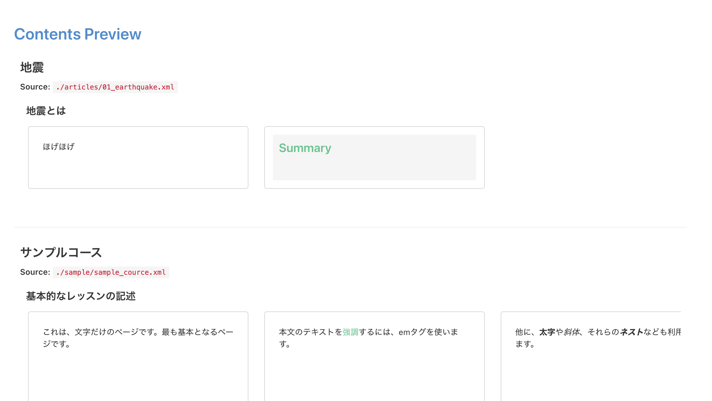

# noah Contents Repository

noahのコンテンツを記述・格納するためのリポジトリです。


## Requirements
- XSLでフォーマットされたXSD文書が閲覧可能なブラウザまたは処理系
  - Firefox でテストしています
- Node.js
- Java (参考: [xsd-schema-validator](https://www.npmjs.com/package/xsd-schema-validator))
- GNU Make

## Usage

### 初めに

XMLの検証やJSONの生成、プレビューサーバに関わるtoolkitの展開とビルドを行います。

```zsh
% make init-toolkit
% make generate
% make init-preview
```

### 記事を執筆する

1. `articles/{cource-name}`branchを切ってcheckoutする
2. `articles/{cource-name}.xml`ファイルを作成する
3. 記事をXML文書として記述する。
記述するXMLのスキーマは [sample.xsd](sample.xsd)を参照してください。
4. 構文をテストする `make test`
5. 記事を生成する `make generate`
6. Pull Requestを出す
   - CIが全て通る かつ 一人以上の人間から記事に対して `approve`　のレビューがつけばmergeして良し

このほかに、記事をプレビューするための`make serve`が利用可能です。([Make Serveについて](#make-serveについて)を参照してください。)

### 構文を変更する
1. `feature/{feature-name}` branchを切ってcheckoutする
2. `schema.xsd`を変更する。
XSDについては[この辺り](https://www.mlab.im.dendai.ac.jp/~yamada/web/xml/xmlschema.html)が日本語文書として有用かもしれません。
3. 既存の文書のテストを通す `make test`

### make serveについて
-  `make serve`は、記事をプレビューするために利用できます
- アプリ上にこの通りに描画される保証はありませんが、テキストスタイリング(太字や斜体、強調など)やメディア(YouTube, 画像)がうまく挿入されることを確認するのに利用できます。
- `make serve`コマンドを実行すると、localhostにサーバが起動します。これは、`Ctrl+C`で終了できます
- サーバを起動したまま記事(XML)を編集して、`make generate`コマンドを打つと、新しい記事の内容で再読み込みされます(Hot reload)


